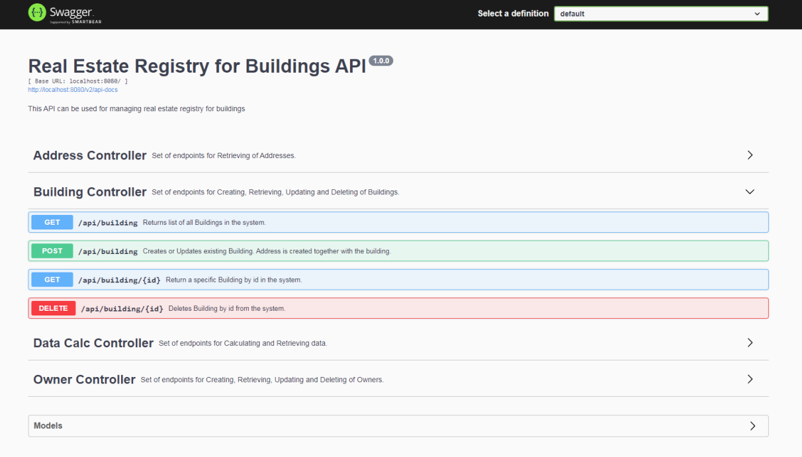

# Real Estate Registry for Buildings
The system is designed to manage real estate registry for buildings. Implemented using Spring Boot. Documented with Swagger.

___

## Getting started
1. Clone the [repository](https://bitbucket.org/LukasevicRobert/zenitech/src/main/)
2. Open _Spring Tools Suite_ 
3. Import project: File -> Import... -> Maven -> Existing Maven Projects -> Next -> Browse... ->
_select folder the project was saved in f. ex.:_ G:\Programs \Real_Estate_Registry_for_Buildings\ **back** -> Finish
4. Right Mouse Click on the project -> Run As -> Spring Boot App
5. System will launch on port [8080](http://localhost:8080/)
6. System may be tested using Swagger doc. [/swagger-ui/](http://localhost:8080/swagger-ui/)

___

___

## System Entities:
* Building
* Owner
* Address

## System Endpoints:
| Endpoint  | Operation |
| ------------- | ------------- |
| [/api/building](http://localhost:8080/api/building) | create, update, read, delete building |
| [/api/owner](http://localhost:8080/api/owner)  | create, update, read, delete owner  |
| [/api/address](http://localhost:8080/api/address)  | read address |
| [/api/calc/tax/yearly-real-estate/](http://localhost:8080/api/calc/tax/yearly-real-estate/)  | calculate total yearly real estate tax rate by owner id |